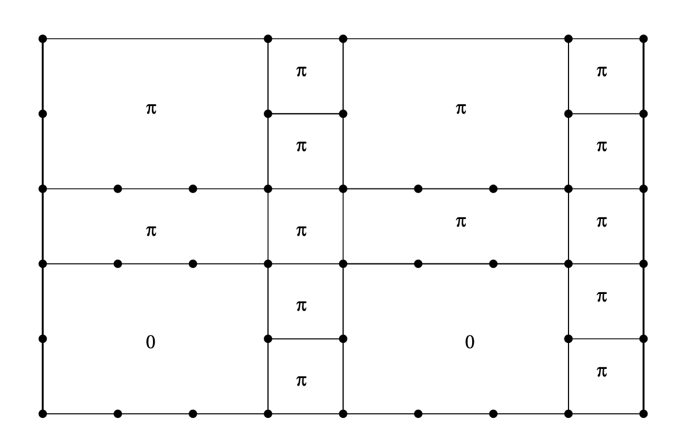
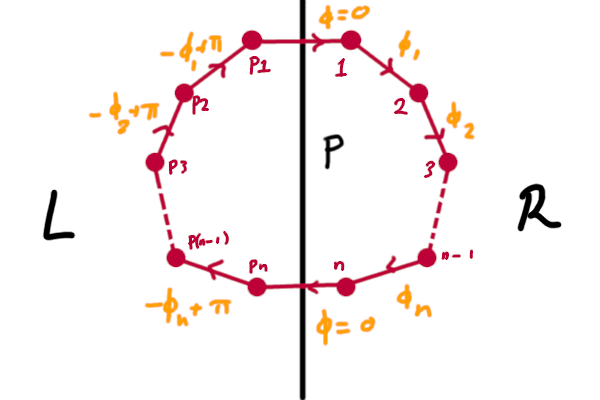

If you're following along the [Kitaev paper](https://arxiv.org/abs/cond-mat/0506438), you will
eventually strike (on page 17) the rather crypic remark that

> This statement follows from a beautiful theorem proved by Lieb [50].

I followed up on that, leading me to Lieb's 1994 (!) paper, which incredibly can be [found on
arXiv](https://arxiv.org/pdf/cond-mat/9410025v1.pdf). The proof was later [streamlined and
generalised](https://arxiv.org/abs/cond-mat/9604043) by Macris and Nachtergaele a few years later,
and it's their proof that I'm going off here (for the most part).

There is still absolutely no way to top Lieb's original graphic design sense though, so I'll shamelessly
reuse his title art:

# Definitions

We consider the model of spinless fermions hopping around on a lattice $$\Lambda$$. (Spin will be
added later.)

$$H = \sum_{x,y \in \Lambda} t_{xy}e^{i\phi_{xy}} c_x^\dagger c_y$$

The $$t, \phi$$ satisfy hermiticity relationships $$t_{xy} = t_{xy}, \phi_{xy} = - \phi_{yx}$$. It will
be convenient to refer to the $$\Lambda$$ and $$(t,\phi)$$ interchangeably as _the model_, standing in for
the equivalent model interpretations as a directed complex valued graph or a hermitian matrix.
Physically, $$\phi$$ is a U(1) gauge field / gauge connection. You can view them either as a set of
numbers over which to optimise, or as the eigenvalues of some continuous U(1)-valued operator. In
the second interpretation, we find the gauge sector that minimises the Hamiltonian's energy.

**Definition 1**: Let $$\gamma$$ be an oriented closed loop in $$\Lambda$$. The _flux_ of $$\gamma$$ is defined as

$$\Phi[\gamma] = \sum_{\langle xy\rangle \in \gamma} \phi_{xy}$$

We also introduce a small (trivial) lemma:

**fluxes are gauge invariant**
Define a 'discrete scalar field' $$\theta:\Lambda \to \mathbb{R}$$. Modulating all $$\phi_{xy}
\mapsto \phi_{xy} + \theta_x - \theta_y$$ does not alter the value of any fluxes. (This can be
interpreted as a discretised version of $$\nabla \times \nabla f = 0$$, or $$d^2= 0$$ if you're fancy)

**Definition 2**: A _site avoiding mirror plane_ $$P$$ is a symmetry of $$\Lambda$$,

$$P : \Lambda \to \Lambda$$

such that $$P(x) \neq x$$ and $$ t_{x,y}= t_{Px, Py} $$. 

If the graph is embedded into $$\mathbb{R}^D$$, then this can be thought of as a mirror plane that
cuts bonds but does not slice through any sites. 

## An interesting fact about the fluxes

This deserves its own section because of its importance in the Kitaev model. 

We can define $\Phi[\gamma]$ more generally as a string operator

$$\Phi[\gamma] = \prod_{\langle ij\rangle \in \gamma} t_{ij}e^{i\phi_{ij}}c^\dagger_i c_j$$

**Exercise**: Show that $[c^{\dagger}_jc_j, \Phi[\gamma]]$ is only nonzero when $j$ is at the
beginning or end of the chain.  
Convince yourself that this proves that the loops have simultaneous eigenstates with the Fermion basis, and that $\Phi[\gamma]$ represents a fermion transport operator.

# Statement of the Theorem
Let the $$t_ij$$ be structured such that
- (A1) $$\Lambda$$ is bipartite $$\Leftrightarrow$$ all circuits on the graph have even length
- (A2) Each closed loop $$\gamma$$ defined on the links of $$\Lambda$$ possesses a site avoiding
  mirror plane.

A graph satisfying A2 is shown below (taken from [Macris and Nachtergaele 1996](https://arxiv.org/abs/cond-mat/9604043))

If (A1) and (A2) are satisfied, then the free energy $$F = -k \ln \text{tr} e^{-\beta H}$$ is minimised when the fluxes are

$$ \Phi(\gamma) = \begin{cases} \pi & \|\gamma\| = 0\ \text{mod}\ 4\\ 0 & \| \gamma \| = 2\ \text{mod}\ 
4 \end{cases} $$

where $$\|\gamma\|$$ is the length of the path.

Some references only explicitly deal with the $$T=0^+$$ (i.e. $$\beta=1/T \to \infty$$) limit, where the free energy is replaced by the ground state energy:

$$F = -T \ln(\text{tr} \exp(-\beta H)) = - T \ln(\sum_i e^{-\beta E_i}) \sim -T (-\beta E_0) = E_0$$
where $E_0$ is the ground state energy. 

# Preliminaries

## Complex conjugation and antiunitary operators

Complex conjugation (aka time reversal $T$) needs to be handled carefully because it is
_antilinear_, $T \alpha = \bar{\alpha} T  \forall \alpha \in \mathbb{C}$.

Its defining property is that, given a time reversible Hamiltonian $H$ with time dependent solution $\ket{\Psi(t)}$ the time reversed statevector $T\ket{\Psi(t)}$ satisfies the
time-reversed Schrödinger equation,

$$i\hbar \frac{\partial}{\partial(-t)} T \ket{\Psi(t)} = H T \ket{\Psi(t)}$$

We only assumed $T$ to be an operator on the Hilbert space - we have no idea if it is linear or not.

In fact, it isn't $$\mathbb{C}$$-linear. Rearranging shows that $T^{-1} (-i) T  = i$. We can require
$T$ to preserve norms, which implies $\braket{T\psi \vert T\psi} = \braket{\psi \vert \psi}$ for all
basis elements. It can be shown from the fact that $[T,H]=0$ and the definition that $T$ is $\mathbb{R}$-linear.

This implies that $T$ is _antiunitary_: and $\mathbb{R}$-linear operator where
$$\braket{T\psi \vert T\phi} = \overline{\braket{\psi \vert \phi}}$$. $\mathbb{R}$-linearity implies
that $T(\alpha\ket{\psi} + \beta\ket{\phi}) = \overline{\alpha} \ket{\psi} + \overline{\beta}
\ket{\phi}$.

**Lemma** There exists an orthogonal _real basis_ of the Hilbert space that is $T$ invariant and
unique up to factors of -1.

_Proof_: Start with any old orthogonal basis $\{\ket{n}\}$. I define $K$ to be the unique
antihermitian operator satisfying $K\ket{n} = \ket{n}$. Viewing the Hilbert space as an $\mathbb{R}$-vector space of twice the dimension, we construct a new (doubled) basis 
$\{\ket{n}, i\ket{n}\}$. $K$ is then constructed explcitly via $K\ket{n} = \ket{n}, Ki\ket{n} =
-i\ket{n}$. It follows immediately that $K$ is antilinear and $K^2 = 1$. Note that $K^\dagger$ is **not defined** for
antilinear operators. 

$KT$ and $TK$ are unitary, since $\braket{TK\phi \vert TK \psi} = \overline{\braket{K \psi \vert K \phi}} =
\braket{\phi \vert \psi}$, which proves the lemma since $T KK = T = UK$ for some unitary operator
$U$. $U^{1/2}$ provides the necessary basis change. 

**Corrolary** A particular basis $\{ \ket{e_i} \}$ has a unique associated antilinear operator $K$
that leaves every basis vector invariant.

**Lemma** Given a $\mathbb{C}$ linear operator $A$ on the Hilbert space $\text{Span}\{ \ket{e_i} \}$ with associated antilinear $K$, $\bra{e_i} KAK \ket{e_j} = \overline{\bra{e_i}A\ket{e_j}}$

_Proof_: $$\bra{e_i} KAK \ket{e_j} = \bra{e_i} KA \ket{e_j} =  \braket{e_i, KAe_j} = \overline{\braket{Ke_i, Ae_j}} = \overline{\braket{e_i, Ae_j}} = \overline{\bra{e_i}A\ket{e_j}}$$

**Corrolary** In any basis, $\bra{K\phi}KAK\ket{K\psi} = \overline{\bra{\phi}A \ket{\psi}} $ 

This really shows up the complacency that Dirac notation breeds - it's tempting to just absorb the K into the
left hand bra, but this is only correct for $\mathbb{C}$-_linear_ operators!

There's not much elegance in the proof. Most of the work is actually in
proving an annoying technical result.

## The Annoying Technical Result (ATR)

Let $$A,B,C_j, j=1...M$$ be linear operators on a Hilbert space $$\mathcal{H}$$, where $A,B$ are self adjoint
and there is a basis for $$\mathcal{H}$$, $$( \ket{e_\alpha} )_{\alpha=1}^N$$ (where $N$ may be countably infinite)
such that the matrix elements $\bra{e_\alpha}C_j\ket{e_\beta}$ are real for all $j$. Call this basis
the 'real basis' of Beverly Hills.

Define:
 - The complex conjugation operator $K$ to be the unique antiunitary operator that leaves this basis invariant.
 - $$H[A,B]: \mathcal{H}^{\otimes 2} \to \mathcal{H}^{\otimes 2}$$ using $$H[A,B] = A\otimes 1 + 1 \otimes B + \sum_j C_j \otimes C_j$$. 
 - $E_n(M)$ to be the $n$th eigenvalue of a hermitian matrix, ordered smallest to largest.
 - Free energy of a Hamiltonian to be $$F(H) = -T \ln(\text{tr} e^{-\beta H}) = -T \ln\left( \sum_n
   e^{-\beta E_n(H)} \right)$$

The theorem then states that
 - **Zero temperature** The lowest eigenvalue of this operator, $$E_0 \circ H[A,B] \le \text{min} \{ E_0 \circ H[A,\overline{A}], E_0\circ H[\overline{B},
B]\}$$.
 - **Finite temperature** The free energy of this Hamiltonian does the same thing, $$F \circ H[A,B] \le \text{min} \{ F \circ H[A,\overline{A}], F\circ H[\overline{B},
B]\}$$.

$\overline{A}$ is defined by $K A K$, corresponding to the complex conjugate in its matrix
representation with respect to the real basis. We'll write $E_n(A,B) as shorthand for $E_n \circ
T[A,B]$, and use the same shorthand for the free energy.

Let $\ket{\Omega_n}$ be the $n$th eigenstate of $H[A,B]$. With respect to the real basis, it may be
expressed as $\ket{\Omega} = \sum_{ij} M_{ij} \ket{e_i} \otimes \ket{e_j}$.

We compute the Schmidt decomposition of $\Omega_n$ by taking the
[SVD](https://en.wikipedia.org/wiki/Singular_value_decomposition) of $M$: $M_{ij} = \sum_\alpha U_{i\alpha} \lambda_\alpha V_{\alpha j}^\dagger$ for
unitary $U,V$, $\lambda_\alpha\ge 0$. This invites the definition of alternative bases for the 'first' and 'second'
subspaces, $$ \{ \ket{\phi_\alpha} = U_{i\alpha} \ket{e_i} \}$$ and $$\{ \ket{\psi_\beta} = V_{\beta
j}^\dagger \ket{e_j} \}$$.

$$\ket{\Omega_n} = \sum_\alpha \lambda_\alpha \ket{\phi_\alpha} \otimes \ket{\psi_\alpha}$$

Now note that $\lambda_n(A,B) = \bra{\Omega_n} H[A,B] \ket{\Omega_n}$

$$ = \sum_{\alpha} \lambda_\alpha^2 \left[ \bra{\phi_\alpha} A \ket{\phi_\alpha} + \bra{\psi_\alpha} B
\ket{\psi_\alpha} \right] - \sum_{j \alpha \beta} \lambda_\alpha \lambda_\beta \bra{\phi_\alpha}
C_j \ket{\phi_\beta} \bra{\psi_\alpha} C_j \ket{\psi_\beta} $$

### Zero temperature case

Let's start with the case $n=0$.

Define the (normalised) ground state Ansätze 

$$\ket{A} = \sum_\alpha \lambda_\alpha \ket{\phi_\alpha} \otimes K\ket{\phi_\alpha}, \hspace{2em}
\ket{B} = \sum_\alpha \lambda_\alpha \ket{\psi_\alpha} \otimes K\ket{\psi_\alpha}$$

Our strategy will be to show that 

$$
E_0(A,B) \ge \frac{1}{2} \left[\bra{A}H[A, \overline{A}] \ket{A} + 
\bra{B}H[\bar{B},B]\ket{B}\right] \ge \frac{1}{2}[E_0(A,\bar{A})
+ E_0(\bar{B}, B)]
$$

The second inequality follows from the variational principle. The first requires us to expand the expression

$$\frac{1}{2}\left[\bra{A} H[A,\bar{A}] \ket{A} + \bra{B} H[\overline{B}, B] \ket{B} \right]$$

$$
= \frac{1}{2}\sum_{\alpha} \lambda_\alpha^2 \left[ \bra{\phi_\alpha} A \ket{\phi_\alpha} + \bra{K\phi_\alpha} KAK
\ket{K\phi_\alpha}  + \bra{K\psi_\alpha} KBK \ket{K\psi_\alpha} + \bra{\psi_\alpha} B \ket{\psi_\alpha}\right] 
 - \frac{1}{2}\sum_{j \alpha \beta} \lambda_\alpha \lambda_\beta \left[
\bra{\phi_\alpha} C_j \ket{\phi_\beta} \bra{K\phi_\alpha} C_j \ket{K\phi_\beta} +
\bra{K\psi_\alpha} C_j \ket{K\psi_\beta} \bra{\psi_\alpha} C_j \ket{\psi_\beta} 
\right]
$$

Now, use Hermiticity of $A,B$ to get $\bra{K\phi}KAK\ket{K\phi} = \overline{\bra{\phi}A \ket{\phi}} =
\bra{\phi}A\ket{\phi}$ and reality of $C$ to get $\bra{K\phi_\alpha} C_j \ket{K\phi_\beta} =
\bra{\phi_\beta} C_j \ket{\phi_\alpha}$, $\bra{K\psi_\alpha} C_j \ket{K\psi_\beta} =
\bra{\psi_\beta}C_j\ket{\psi_\alpha}$

$$
 = \sum_{\alpha}  \lambda_\alpha^2 \left[ \bra{\phi_\alpha} A \ket{\phi_\alpha} + \bra{\psi_\alpha} B \ket{\psi_\alpha}\right] 
 - \frac{1}{2}\sum_{j \alpha \beta} \lambda_\alpha \lambda_\beta \left[
\bra{\phi_\alpha} C_j \ket{\phi_\beta} \overline{\bra{\phi_\alpha} C_j \ket{\phi_\beta}} +
\overline{\bra{\psi_\alpha} C_j \ket{\psi_\beta}} \bra{\psi_\alpha} C_j \ket{\psi_\beta} 
\right]
$$

Now, letting $u = \bra{\phi_\alpha} C_j \ket{\phi_\beta}, v = \bra{\psi_\alpha} C_j
\ket{\psi_\beta}$, the situation we have is 

$$
E_0(A,B) - \frac{1}{2} \left[\bra{A}H[A, \overline{A}] \ket{A} + \bra{B}H[\bar{B},
B]\ket{B}\right]
$$

$$ = \sum_{j} \sum_{\alpha \beta} \frac{\lambda_\alpha \lambda_\beta}{2} \left[ |u|^2 + |v|^2 -
2|uv|
\right] \ge 0 $$

using the Cauchy-Schwartz inequality and appropriate symmetries. This proves the result we needed
for the case $n=0$, i.e. the zero temperature limit.

### [WIP] Finite temperature

**Exercise:** show that the finite temperature case of the theorem is equivalent to showing that

$$ \sum_n e^{-\beta E_n(A,B)} \le \text{min} \left\{ \sum_n e^{-\beta E_n(A,\overline{A})}, \sum_n
e^{-\beta E_n(\overline{B}, B)} \right\} $$

When we take $\ket{A_n}$ constructed as before (from the Schmidt decomposed
$\ket{\Omega_n}$), $E_n$), the algebra from before still holds so far as showing

$$E_n (A,B) \ge \frac{1}{2} \left[\bra{A_n} H[A,\overline{A}] \ket{A_n}+ \bra{B_n} H[\overline{B},B]
\ket{B_n}  \right] $$

It follows that 

$$ \sum_n e^{-\beta E_n(A,B)} \le \text{min} \left\{ \sum_n e^{-\beta \bra{A_n} H[A,\overline{A}]\ket{A_n} }, \sum_n
e^{-\beta \bra{B_n} H[\overline{B}, B] \ket{B_n}} \right\} $$

[missing]

It then follows straightforwardly that the energy can always be decreased by letting $B = \bar{A}$,
so this configuration is (at least one) ground state.

$$\square$$

# Proving the flux phase theorem

There are three steps involved in transforming $H$ into the form of the annoying technical result
(ATR). 
1. Jordan-Wigner like transformation
2. Gauge transformation
3. Particle/hole symmetry

Consider a loop $\gamma$, with associated site avoiding mirror plane $P$. By assumption, $P$ divides the lattice
$\lambda$ into two groups with a one to one correspondence between them, which we'll call $\Lambda_L,\Lambda_R$ for
the 'left' and 'right' sites. 

The JW like transform is

$$ d_x = (-)^{N_L}c_x, d_x^\dagger = c_x^\dagger (-)^{N_L}$$

where $N_L = \sum_{x\in L} c_x^\dagger c_x$ is the number of fermions on the left. 

**Exercise**: the $d$'s are still fermions.

The (original) Hamiltonian gets a minus sign on all terms that involve left-right exchange.

$$ H = \sum_{x,y \in \Lambda_L} t_{xy} e^{i\phi_{xy}} d_x^\dagger d_y +
\sum_{x,y \in \Lambda_R} t_{xy} e^{i\phi_{xy}} d_x^\dagger d_y -
\sum_{x\in \Lambda_L, y \in \Lambda_R} t_{xy} e^{i\phi_{xy}} d_x^\dagger d_y 
-\sum_{x\in \Lambda_L, y \in \Lambda_R} t_{xy} e^{-i\phi_{xy}} d_y^\dagger d_x
$$

We established earlier that the gauge fluxes are invariant under a local U(1) rotation $d_x \to
e^{i\theta_x} d_x$. (It's clear that this transformation alters neither eigenstate nor spectrum)
The even-memberedness of the loop guarantees that there exist some gauge transform $\phi \mapsto
\phi'$ such that $\phi' = 0$ on all  links between $L$ and $R$.

Now use the _antiunitary_ particle-hole symmetry $d\leftrightarrow d^\dagger$ (corresponding to a swap $\ket{0} \leftrightarrow \ket{1}$ in the Hilbert space), applied to the right sites only, to get

$$ H =  \sum_{x,y \in \Lambda_L} t_{xy} e^{i\phi_{xy}} d_x^\dagger d_y +
\sum_{x,y \in \Lambda_R} -t_{xy} e^{-i\phi_{xy}} d_x^\dagger d_y + 
\sum_{x\in \Lambda_L, y \in \Lambda_R}  -t_{xy} d_x^\dagger d_y^\dagger  +
\sum_{x\in \Lambda_R, y \in \Lambda_L}  -t_{xy} d_x d_y
$$

It can readily be shown that the $L$, $R$ and $LR$ terms satisfy all of the necessary constraints to
be regarded as the $A,B, \sum_jC_j\otimes C_j$ from the ATR when acting on the split Hilbert space
$\mathcal{F}_L\oplus\mathcal{F}_R$.

If follows that the free energy $F$ is minimised when $A = \bar{B}$, i.e. $e^{i\phi_{Pi,Pj}} = -e^{-i\phi_{i,j}} \Leftrightarrow \phi_{Pi,Pj} \equiv -\phi_{i,j} + \pi\ \text{mod}\ 2\pi$. 

In terms of the original (i.e. physical) basis $c_j$, this translates to requiring $\phi_{ij} =
\phi_{Pi,Pj} + \pi\ (mod\ 2\pi)$.

Now consider the flux of the loop $\gamma$. For the gory details written out with indices see the
paper, but I find the sketch more convincing: 

To see the cancellation, all we need to notice it that $\Phi$ consists of $n-1$ products of $t_{12}e^{i\phi_{12}} t_{P2 P1}e^{i\phi_{P2P1}} = -t_{12}^2$.

It's immediate from this that $\Phi(\gamma) = (n - 1)\pi\ (\text{mod}\ 2\pi) $, which is exactly the
result we set out to prove. $\square$

##  Concluding remarks

There are a number of important generalisations that are possible that introduce spin indices and
additional Hubbard type fermion interactions, but the proof presented here is complete on its own
and captures the essence of the result. The generalisation / restatement that is relevant for the
Kitaev model is repeating the derivation with Majorana fermions, which ultimately boils down to some
slightly different phase massaging but the same result overall.

