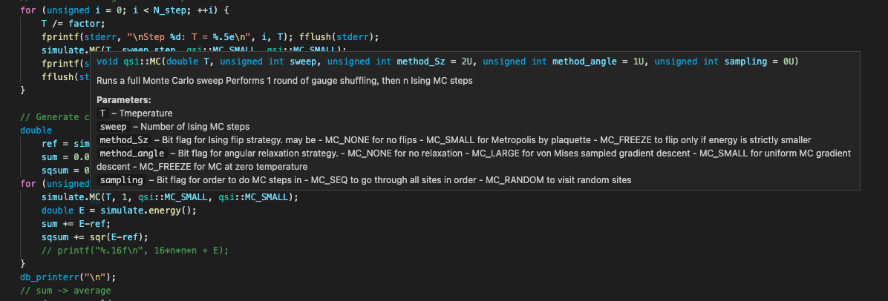

There are three essential reasons that scientists _should care about following good programming practices_:

1. Good science should be _independently verifiable_, so there is a moral obligation to make
   code accessible for others to read, understand and run to check your work.
2. Good code is _easier to modify_- investing a few weeks into setting the problem up robustly can
   translate to massive time savings later, particularly if someone else starts maintaining your
   code
3. Good practices make you _more confident that the result you have is correct_: Making code modular
   allows you to test different subsections independently, rooting out bugs before they cause weird
   behaviour somewhere else.


To see what I mean, I'll reference two toy models I want to simulate physically. In particular, I'll
define _Model Inputs_, which are the abstract ideas that the routine needs to grapple with, and
_Model Outputs_, the abstract notions that the code should somehow output. The details of how these
abstract concepts are represented still need to be nailed down.

_Model A: A deterministic Schrödinger equation solver._ 'Exactly' diagonalises the Hamiltonian for `n`
interacting particle in an arbitrary 1D potential well V(x).

Inputs: 
 + `V(x)`: The potential well.
 + `n`: The number of particles.
 + `n_states`: The number of eigenvalues we want to find (0 = ground state only)

Outputs:
 + Energy/ies
 + Wavefunction/s

_Model B: Spin-Wave Theory._  Find the classical ground state of a lattice, expand the ground state
in Holstein-Primakoff bosons, truncate to next-leading order and diagonalise the Hamiltonian. Then
predict the spin correlators seen by neutron scattering.

Inputs:
 + `Lattice`, describing the sites and connectivity of the magnetic sites
 + `corrtype`, specifying which correlators to probe (the relevant one depaands on the kind of spins
   being investigated)
 + `BZpath`, the path through the Brillouin zone to plot
 + `B`, the external, applied magnetic field

Outputs:
 + Magnon dispersion along a specific curve in $k$ space
 + Spectral weight as seen in a single crystal scattering experiment
 + Spectral weight as seen by a powder diffraction experiment

## The Zen of Physics Code

> Before I met Jeanine, my life was cosmically a shambles, it was ah... I was using bits and pieces of whatever
> Eastern philosophies happened to drift through my transom and she sort of sorted it out for me, straightened
> it out for me, gave me a path, you know, a path to follow.

 \- David St. Hubbins, _This is Spinal Tap_

 1. Make it obvious where data comes from.
 2. Make it obvious what programs do.
 3. Programs should do one thing and do it well.
 4. At most three shell commands should be involved in transforming parameters into a publishable
    graph.
 5. Label everything.

The general idea here is to write executables and datafiles that can be read as verbs and nouns
that describe the whole calculation:

```
[ Find the two-body Hamiltonian ] of ( n electrons ) and [ diagonalise it ]
```

```
[ Find the classical ground state ] of ( spins on a lattice ), 
[ expand to second order in Holstein-Primakoff bosons ] and
[ find the corresponding spin correlators ], 
then [ average over them with Monte Carlo ]
```

Each item in `[ brackets ]` can be interpreted as a verb, and arguably deserves its own executable, and the item in `( parentheses )`
should have an input file associated with it. Obviously there's a judgement call to make here when
you decide how to
modularise everything - if the code is fast, it can be more appropriate to have a 'god verb' that
does everything. These guidelines are intended for a fairly specific use case, a **complicated,
multi-step calculation** that technically only needs to run once. 

Less abstractly, these maxims translate to
 1. Every datafile in your output should have the input that made it and the tools to interpret it saved with it.
 2. Write your 'verbs' in such a way that they can be used without reading the source code.
    Instead of crashing when you use an incorrect call sequence, gently remind the user how it's
    meant to be called with a message. Use at most 4 command line parameters, any
    more and they should be in a file.
 3. Your code does not have to fit into one executable. If your simulation involves precalculating
    some parameters then running a MC simulation, you should have two executables `calc_params` and
    `run_sim`, where the latter is fed output from the former. The intermediate data should be saved to a file (with metadata), as per [1].
 4. Your project should have at most three levers - "run simulation", "process data" and "plot data". (A good way to
    achieve this is with shell or python scripts).
 5. Magic numbers - in the sorce code, _or in the in/out files_, are not allowed.

# Directory structure

This is more art than science, but if you're writing your first big project it can seem an
insurmountable obstacle to even establish where to start. 

The thing to have in mind is this: For science code, the main tasks you'll be doing are
 1. Writing the simulation.
 2. Creating new simulations with slightly different parameters
 3. Plotting the output data in new, interesting ways

The goal now is to minimise the hassle that these tasks cause.


## Example: Model A

```
mdA + .gitignore
    + Makefile
    + README.md
    + _driver ----- + simulate.sh 
    |               + process.sh
    + _process ---- + plot_wavefunc.py
    |               + plot_momentum.py
    |               + correlate.ipynb
    |               + img --------- + wavefun_onepart.pdf
    |                               + wavefun_twopart.pdf
    + bin --------- + simwavfunc
    |               + simspinfunc
    |               + spinwavfunc_field
    + src --------- + sim.h
    |               + sim.c
    |               + ...
    + input -----   + one_part.inp
    |               + two_part.inp
    |               + potentials -- + harmonic.csv
    |                               + quartic.csv
    |                               + free.csv
    + data   ------ + one_part ---- + _sim_params.inp
                    |               + _potential.csv
                    |               + rcorr.csv
                    |               + pcorr.csv
                    |               + wavefunc.csv
                    |               + energy.csv
                    + two_part ---- + _sim_params.inp
                                    + _potential.csv
                                    + rcorr.csv    
                                    + pcorr.csv
                                    + wavefunc.csv
                                    + energy.csv
```

I'm using underscores to push the most important things to the top of `ls` output.
Creating and running a simulation might then look like

```bash
cd mdA
cp input/two_part.inp input/three_part.inp
vi input/three_part.inp # edit the input parameters...
bin/simwavfunc input/three_part.inp data/three_part
# wait until finished...
python3 _process/plot_wavefunc.py data/three_part
```

The bash scripts `simulate.sh` and `plot.sh` are the last things to be
added before publishing. They contain, respectively
```bash
#!/bin/bash
# simulate.sh
mkdir data

for sim in `ls input`; do
    # remove the extension to get the folder name
    s= "${sim%.*}"
    mkdir "data/$s"
    bin/simwavfunc "input/$sim" "data/$s"
done
```

```bash
#!/bin/bash
# process.sh
mkdir _process/img
for dir in `ls data`; do
    python3 _process/plot_wavefunc.py "data/$dir"
done
```
These are the two levers of maxim [4].

Note `_sim_params.inp` in the output folders. These are copies of `one_part.inp` and `two_part.inp`, which
are _produced by the simulation executable_. This is helpful for many reasons:
- In case you change any of the input data while your code is running (very easy to do if it spans
   multiple days)
- To keep metadata with data (maxim [1])
- To reassure you that the program is reading the parameters correctly.
- To keep all the data that a post-processing script needs in one place.

Some extra features of this structure are:
- The programs involved never have to traverse system directories. This is helpful for code
   readability and cross-platform compatibility.
- The data folder could be called anything and located anywhere (even on a networked drive!) 
- We don't need any fancy programs or file parsers to read everything that happens.

If necessary, judicious use of `tar` can compress the data files if you need to transfer them
between different computers. (Cheat sheet: `tar -scvf MyDir.tar.gz MyDir` to compress, `tar-xvf
MyDir.tar.gz` to unzip. It's unlikely that you would ever need to do anything else with `tar`.)


## Example: Spin Wave theory

The requirements here are a bit different. One of our inputs is a 3D lattice, which has complex
structure that can't be represented in a simple CSV / `.inp` file. In this case, it's more
appropriate to use a "real" format (e.g. TOML) to store the complicated input data (see below for
details).


```
mdB + .gitignore
    + Makefile
    + README.md
    + _process ---- + _fit_cote_0p05.py
    |               + _fit_cote_1p70.py
    |               + fitting.ipynb
    |               + correlate.ipynb
    |               + spinW.py
    + fig --------- + powder_honeycomb_realistic.pdf
    |               + dispersion_honeycomb_realistic.pdf
    |               + ...
    + bin --------- + spinwave
    |               + paverage
    + src --------- + sim.h
    |               + sim.c
    |               + ...
    + experimental  + CoTe_sqw_0p05K.csv
    |               + CoTe_sqw_1p70K.csv
    |               + ...
    + lattice ----- + honeycomb.toml
                    + cubic.toml
                    + pyrochlore.toml
```


This one's a bit different. The use case here is _fitting experimental data using the spinwave
toolchain_ - the `.ipynb` notebooks function for experimentation, but the final data is prodcued by
the python scripts `_fit_cote_0p05.py,_fit_cote_1p70.py`. The compiled binaries are called by the
library `spinW.py`.
                    

# File formats for input

It's really tempting to write input files quick and dirty. For example:
```
# input.in
# first run, single particle test in a harmonic trap
1 # number of particles
11 # number of sites
25 16 9 4 1 0 1 4 9 16 25 # potential (must have n = number of sites)
1e-4 # interaction strength
```

or even more mystically

```
1
11
25 16 9 4 1 0 1 4 9 16 25
1e-4
```


The last two structures are "simple" to parse in a C-like language -

```c

#include <stdio.h>
#include <stdlib.h>
#include <string.h>

#define MAX_LINE_LEN 1024

void parse_file(
    const char* fname,
    uint16_t* nparts,
    uint16_t* nsites,
    double** V,
    double* istrength
    ) {

    FILE* fp = fopen(fname, "r");
    char linebuf[MAX_LINE_LEN];
    // read first line
    fgets(linebuf, MAX_LINE_LEN, fp);
    *nparts = atoi(linebuf);
    // read second line
    fgets(linebuf, MAX_LINE_LEN, fp);
    *nsites = atoi(linebuf);

    *V = (double *) malloc(sizeof(double)* (*nsites));
    // read third line V into memory
    fgets(linebuf, MAX_LINE_LEN, fp);
    // assume space delimiters
    char *token = strtok(linebuf, " ");

    uint16_t idx=0;
    while( token != NULL ) {
        (*V)[idx] = atof(token);
        token = strtok(NULL, " ");
        idx++;
        if (idx >= *nsites) break; // make sure we don't overrun!
    }

    // read fourth line
    fgets(linebuf, MAX_LINE_LEN, fp);
    *istrength = atof(linebuf);
}

```

From a scientific perspective, the code is very dangerous. Suppose you miscount and write 

```
1
15
25 16 9 4 1 0 1 4 9 16 25
1e-4
```

Then the program will *silently* allocate more space than is needed for `V`, and will set them to
zero (if the OS is being polite) or to whatever crap was lying in the ram before your program got hold of
it!

Even worse is if we forget the line order:

```
1
1e-4
25 16 9 4 1 0 1 4 9 16 25
11
```

It's not clear what `atoi` will do now, but it definitely isn't the right thing, and there will
again be no warnings about this.

`#define MAX_LINE_LEN 1024` might also become a problem if we have a somewhat large potential -
that's only enough to fit ~40 plaintext doubles with full precision.

None of these issues are unfixable, it's just a massive timesink trying to sort these annoying
data validation issues out. I propose a few ideas for alternatives below.

The worst option for handling input is using command line arguments.
```
./sim 1 11 25 16 9 4 1 0 1 4 9 16 25 1e-4
```
This is completely opaque, and is a flagrant violation of [1] and [2]. In my opinion, command line
arguments should _never_ be used to specify physical parameters. They should _only_ be used for specifying
computational parameters that _do not affect the output's meaning_, such as the RNG seed, whether or
not to use GPU acceleration, or the number
of threads to use for multithreading. 

If you really can't part
with command line arguments for spinning up new simulations, it's easy enough to write a shell script to
impement the same functionality:

```bash
#!/bin/bash
echo '' > $1
echo system_size = $2 >> $1
echo temperature = $3 >> $1
bin/sim $1 $1.out
```


## Rolling your own parser code

This can be defensible if you only have a small number of low-complexity inputs. There's something
to be said for avoiding dependencies on libraries. Some guidelines for doing this though:

 - Write the input file _before_ you write the parser.
 - Use natural-feeling delimiters like `=`, `:`
 - Do it once, do it right, never worry about it again.

My own homebrew shitty parser is on GitHub if you're interested. Its interface works like this:

```c++
#include <parameter.hh>

// Use template magic to declate what types our numeric parameters are
typedef parameters<int, unsigned, double> param_t;

int main (int argc, char** argv) {
    // ---------- Reading parameters ----------
    // Required parameters
    if (argc < 4){
        fprintf(stderr, "Required parameters missing\n");
        return EXIT_FAILURE;
    }

    int n;
    double T;
    
    // Optional parameter variables
    unsigned
        sample = 2048,
        sweep  = 4,
        burnin = 128,        
        n_time = 512, 
        n_freq = 128; 
    double
        delta = 0.0625;
    

    param_t p;
    p.declare("system_size",n);
    p.declare("temperature",T);
    p.declare("n_sample", sample);
    p.declare("sweep", sweep);
    p.declare("n_burnin", burnin);
    p.declare("n_timesteps", n_time);
    p.declare("n_Egrid", n_freq);
    p.declare("dt", delta);

    double gphase=0;
    p.declare("theta", gphase);

    //read the params
    p.from_file(argv[1]);


    // ... simulation code uses sample, sweep, burnin....


    std::string param_copy_path(argv[2]);
    param_copy_path.append("/params.inp");
    p.save_file(param_copy_path);
    return 0;
}

```
**Pros**
- Very flexible
- Can be quicker to get running if you know what you're doing
- Can implement data validation that errors if invalid data is fed in

**Cons**
- Lots of ways to mess it up
- Tradeoff between readability of the parser code and readability/robustness of the input file


## JSON / YAML / TOML

Babies of Web 2.0, these standards are widely supported and expert at handling heterogeneous data.
The syntax for YAML and TOML is a bit cleaner than JSON, but the three are otherwise essentially
interchangeable. For a Rosetta stone of sorts, see [this deep
dive.](https://gohugohq.com/howto/toml-json-yaml-comparison/)

**Pros**
- Clean syntax
- Handles heterogeneous data very naturally
- Standard compliance means any decent text editor will highlight the syntax

**Cons**
- Generally requires using a library, which can get annoying in
compiled languages. That being said, several libraries exist to do this which are well documented and can be
installed as header only packages.
    - [TOML++](https://marzer.github.io/tomlplusplus) does TOML, YAML and JSON, and has nice
      documentation
    - [nlohmann/json](https://github.com/nlohmann/json) An older but more active project, with
      harder to navigate docs
- No data validation by default, this also has to be done by hand

## HDF5

If your input is __very__ complicated, you may want to consider using
[HDF5](https://www.hdfgroup.org/solutions/hdf5), standing for
Hierarchical Data Format. I've never had to use it personally, so I can't say much aside from a
brief overview. This is also a good choice for multifaceted output data if you want to federate
everything into a single file.

**Pros**
- Very flexible
- Platform independent
- Efficient data IO
- Capable of storing any kind of heterogeneous data in one spot
**Cons**
 - The generality of the format makes the library functions complicated to use.
 - Requires specialised software to read it


# The Output File

This may be a single federated output that contains a complex set of data, or a collection of files
grouped by a common root e.g. `smallq_input_copy.inp, smallq_wavefunc, samllq_filefunc`. The
metadata that needs to be saved with the output is

1. What input parameters produced this output
2. A timestamp
3. What version of the code was running
4. (optional) How can the output be visualised

[2] and [3] are often overlooked, but they're extremely important if you make changes to your code.
(And if you're doing anything nontrivial, you _will_ be making changes to your code!)

If you go with the simple approach, i.e. managing metadata by copying the input file verbatim to the
output directory (with some clear association between it and the output data, such as a common
filename root), you can just prepend a comment:

```
# input_copy.cff
# run 2022-04-10 17:33
# gs_find v1.14 'new Hermite solver'
system_size = 12
n_sample = 128
n_timesteps = 512
n_Egrid = 128
dt = 0.025
theta = 0.001
```

`.cff` stands for **c**rappy **f**ile **f**ormat.

Just increment the version number every time you change a behaviour. The same goes for TOML, JSON or
any other more respectable markup format. (In fact that's better, because those are trivial to parse
with python, Julia, or even javascript if you hate yourself)


## CSV

It is generally desirable to use common, human-readable data formats.
`.csv` is the obvious choice - it's trivial to implement basic CSV parsers in C++ (and
not much harder in FORTRAN or pure C), and most linear algebra libraries (e.g. Eigen, armadillo)
have built in functions for saving to csv.

This comes at a price - an ASCII representations of a double is not generally an exact mapping (though in practice, any error introduced here will be swamped by the error from more mundane things like roundoff) and is woefully space-inefficient: All of the precision available from a double renders into something like `-1.0123456789012345e+1001`, which is **24 bytes** to store 8 bytes of data.


Another major downside is that your data has to be massaged into a 2D tabular format, severely restricting the
physical applications this is suitable for.


For Model A, one could structure a file containing the observable $\langle \mathbb{r} _ 1 + \mathbb{r} _ 2
\rangle$
```
# 2022-04-02 14:44 GMT V=parabola.csv n=2 n_states=11
# Energy | \<psi|x1 + x2|psi\>
 -11.11229 | 0.298329 ...
```


**Pros:**
 - Portable
 - Simple to implement
 - Easily readable by anyone
 - Metadata can live in the file

**Cons:**
 - Slow IO
 - "Lossy" format
 - Limited to 2D data
 - Documentation must be done with a "hack" in a comment


## Raw binary files

The C standard library function `fwrite` lets you just dump whatever complicated object is in ram onto the disk and call it a day.

**Pros:**
- Really, really easy to implement
- "Lossless" format

**Cons**
- Need to know the structure of the object to read it from RAM, very easy to mix column-major
  ordering and row-major for arrays
- `od` can only get you so far in interpreting a raw binary dump
- Header information must be in a separate file
- Platform dependent (some architectures represent integers
  ["backwards"](https://en.wikipedia.org/wiki/Endianness)). This can be fatal if you intend to
  simulate on one machine (e.g. a cluster) and process on another


## NumPy data format

There is a library for storing array data as `.npy`, the same format that NumPy saves its arrays in
with `a.save('data.npy')`.

**Pros**
- Efficient
- Portable
- Readable by vanilla NumPy 

**Cons**
- Requires a library in C/C++/FORTRAN
- No obvious way to add header information


# Documentation

By default, VS code recognises "javadoc style" function annotations:

```
/**
* @brief Runs a full Monte Carlo sweep
* 
* Performs 1 round of gauge shuffling, then n Ising MC steps
* 
* @param T Tmeperature
* @param sweep Number of Ising MC steps
* @param method_Sz Bit flag for Ising flip strategy. may be
*                  - MC_NONE for no flips
*                  - MC_SMALL for Metropolis by plaquette
*                  - MC_FREEZE to flip only if energy is strictly smaller
* @param method_angle Bit flag for angular relaxation strategy.
*                  - MC_NONE for no relaxation
*                  - MC_LARGE for von Mises sampled gradient descent
*                  - MC_SMALL for uniform MC gradient descent
*                  - MC_FREEZE for MC at zero temperature
* @param sampling  Bit flag for order to do MC steps in
*                  - MC_SEQ to go through all sites in order
*                  - MC_RANDOM to visit random sites
*/
void MC(double T, unsigned sweep, unsigned method_Sz = MC_SMALL,
            unsigned method_angle = MC_LARGE, unsigned sampling = MC_SEQ);
```

In an IDE, this gives you hover-tips:



# Conclusion

There is no one folder structure / file format that fits every project, which is
why so many competing standards exist. Scripting languages (python, R, octave, matlab) are
smoother to use for data processing, while compiled languages (C, C++, FORTRAN, Rust, COBOL) are faster.
There are some languages (Julia, python(numpy + numba)) that are able to "just in time" compile
blocks of code for better performance, but you can't beat old school languages for speed. Odds are that
if you're doing serious numerics, you'll want to paralellise on the CPU / GPU, which is generally
speaking much easier in C/C++/Fortran than it is in fancy modern languages.


The take home message is this: Pity the poor fool that needs to use your code in the future.

