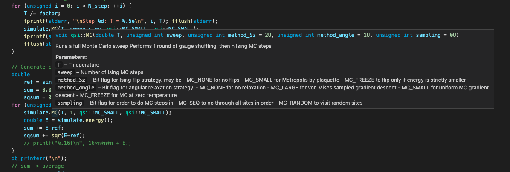

# Introduction

C++, along with vanilla C and Fortran, are the dominant languages of high-performance computing.
Unlike C/Fortran though, it remains popular in the software engineering community, leading to many
headaches when searching the internet for advice. A line should be drawn between the requirements of the tech industry and the requirements of
science: many behaviours that would be unthinkable in
production code are completely fine for scientific code that runs once.

The requirements to be balanced are
1. Write code that is _verifiably correct_.
2. Write code that is _fast_, or at least _not unduly inefficient_.
3. Finish the project in a reasonable amount of time.

# Build systems

## GNU make
This is a tried-and-tested tool for building projects. Like much in the GNU ecosystem, it's an...
eccentric piece of software with a learning curve strongly resembling a cliff. I will not attempt to
explain it, as there are [already](https://makefiletutorial.com/)
[several](https://stackoverflow.com/questions/2481269/how-to-make-a-simple-c-makefile/2481326#2481326)
[attempts](https://www.gnu.org/software/make/manual/) 
on the internet.

I will leave here my own general-purpose "just make it work" makefile (modified from Atilla Szabo's
makefile, and plagiarised from countless forgotten stackoverflow users).


```Makefile
# Created on 01/08/2018
# Copyright (C) 2018 Attila Szabó <as2372@cam.ac.uk>
# Modified 2022 Alaric Sanders <als217@cam.ac.uk>
#
# This program is free software: you can redistribute it and/or modify
# it under the terms of the Creative Commons Attribution License (CC-BY),
# version 4.0 of the License.
#
# This program is distributed in the hope that it will be useful,
# but WITHOUT ANY WARRANTY; without even the implied warranty of
# MERCHANTABILITY or FITNESS FOR A PARTICULAR PURPOSE.
#
# Please find a copy of the Creative Commons CC-BY License on
# <https://creativecommons.org/licenses/by/4.0/>.


# ---------- Compiler and linker directives ----------
CXX = g++

CXXFLAGS = -std=c++2a -pedantic -Wall
CXXOPTS = -O1 -g

src_path := $(dir $(abspath $(lastword $(MAKEFILE_LIST))))

# Output directory after linking
SOURCE_DIR = .
BIN_DIR = ../bin
BUILD_DIR = ../build

# ------ Establishing objects and sources ----

# Search subdirectories as well
COMMON_DIR = common
COMMON_CC = $(wildcard $(SOURCE_DIR)/$(COMMON_DIR)/*.cc )
COMMON_O = $(patsubst $(SOURCE_DIR)/%.cc,$(BUILD_DIR)/%.o,$(COMMON_CC))

MANAGER_DIR = manager
MANAGER_CC = $(wildcard $(SOURCE_DIR)/$(MANAGER_DIR)/*.cc)
MANAGER_O = $(patsubst $(SOURCE_DIR)/%.cc,$(BUILD_DIR)/%.o,$(MANAGER_CC))

STRUCT_DIR = struct
STRUCT_CC = $(wildcard $(SOURCE_DIR)/$(STRUCT_DIR)/*.cc)
STRUCT_O = $(patsubst $(SOURCE_DIR)/%.cc,$(BUILD_DIR)/%.o,$(STRUCT_CC))


# Change ~/include as necessary for your architecture
INC_PATH = -I/opt/homebrew/include  -I$(COMMON_DIR) -I$(STRUCT_DIR) -I$(MANAGER_DIR)

# ---------- Libraries needed for linking ----------

# Change or remove ~/lib as necessary for your architecture
LIB_PATH = -L /opt/homebrew/lib

LIBS = -lstdc++ -lm -lstdc++fs

# ---------- Compilation rules ----------

# Nontrivial header dependences
DEPENDS := $(patsubst %.cc,%.d,$(SOURCES))

# Generic .cc -> .o rule
$(BUILD_DIR)/%.o: $(SOURCE_DIR)/%.cc
	mkdir -p $(@D)
	$(CXX) $(CXXFLAGS) $(CXXOPTS) $(INC_PATH) -MMD -MP $< -c -o $@

# ---------- Linking rules ----------

# Generic .o -> exec rule: uses all prerequisites (meant to be .o files)
%: $(BUILD_DIR)/%.o $(COMMON_O) $(MANAGER_O) $(STRUCT_O)
	$(CXX) $(CXXFLAGS) $(INC_PATH) $(LDFLAGS) -MMD $^ \
	$(LIB_PATH) $(LIBS) \
	-o $(BIN_DIR)/$@

# Don't allow direct compilation 
%: %.cc
# Don't allow removal of object files in chained implicit linking
.SECONDARY:

# Cleanup:
.PHONY: clean
clean:
	-rm -r $(BUILD_DIR)/**
```

This file expects your directory structure to look something like

```
myProject/src + Makefile
              + source1.cc
			  + source2.cc
			  + struct ----- + struct1.hh
			                 + struct2.hh
							 + struct3.hh
```

Note that this makefile traverses all levels of subfolders, which in principle could lead to some
nasty behaviour if you have done some funny business with symlinks.

## `cmake`

is probably not worth your time to learn unless you plan to become a software engineer / distribute
your code widely.


# Documentation

By default, the C/C++ extension to VS code recognises "javadoc style" function annotations:

```
/**
* @brief Runs a full Monte Carlo sweep
* 
* Performs 1 round of gauge shuffling, then n Ising MC steps
* 
* @param T Tmeperature
* @param sweep Number of Ising MC steps
* @param method_Sz Bit flag for Ising flip strategy. may be
*                  - MC_NONE for no flips
*                  - MC_SMALL for Metropolis by plaquette
*                  - MC_FREEZE to flip only if energy is strictly smaller
* @param method_angle Bit flag for angular relaxation strategy.
*                  - MC_NONE for no relaxation
*                  - MC_LARGE for von Mises sampled gradient descent
*                  - MC_SMALL for uniform MC gradient descent
*                  - MC_FREEZE for MC at zero temperature
* @param sampling  Bit flag for order to do MC steps in
*                  - MC_SEQ to go through all sites in order
*                  - MC_RANDOM to visit random sites
*/
void MC(double T, unsigned sweep, unsigned method_Sz = MC_SMALL,
            unsigned method_angle = MC_LARGE, unsigned sampling = MC_SEQ);
```

In an IDE, this gives you hover-tips:



Further, the tool [Doxygen](https://www.doxygen.nl/) can read these annotations and produce a
searchable HTML webpage documenting your code. In practice, this does not tend to be the most
readable thing on the planet, but it's better than no documentation.


