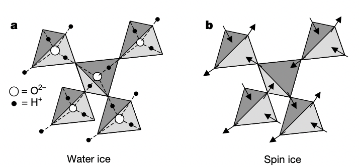
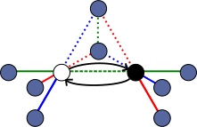
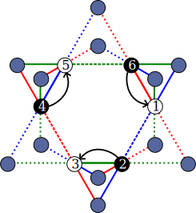
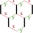
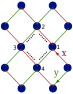

The idea here is the following. We have a Hamiltonian $H$ that is a self-adjoint operator on the
global Hilbert space $\mathcal{H}$, which can be split into a large easy part $H_0$ and a perturbation
$V$. We are only interested in a small part of the spectrum (usually the ground state, or a handful
of states just above it).

Further, we restrict ourselves to the case that the "easy part" of the spectrum consists solely of
$H_0$ eigenstates $\{\ket{m}\}$. We call this the _model space_ $\mathcal{M} = $Span$\{\ket{m}\}
\subset \mathcal{H}$. We want to develop an effective Hamiltonian $H_{eff}:\mathcal{M} \to \mathcal{M}$
that has the same eigenvalues as $H$ on a small subset of its eigenfunctions, or more formally, that
corresponds to the linear projection of $H$ onto $\mathcal{M}$.

We define the projection operator $P : \mathcal{H} \to \mathcal{M}$ by $P = \sum_{m} \ket{m} \bra{m}$.
Clearly $P^2 = P = P^\dagger$. It will be convenient to define $Q = 1-P$ for later use.

Formally, the defining property of $H_{\text{eff}}$ is that any true eigenstate $\ket{\psi}$
satisfying $H \ket{\psi} = E\ket{\psi}$ should also satisfy

$$H_{eff} P \ket{\psi} = E P \ket{\psi} \hspace{3em}[1]$$

We now seek an explicit formula for $H_{eff}$ in terms of $V, H_0, \ket{n}, \epsilon_n$. The game here
will to be splitting the solution $\ket{\psi}$ into two orthogonal components, in such a way
that the final equation is in terms of $P\ket{\psi}$ only.

The original Schrödinger equation may be re-expressed as $(E - H_0) \ket{\psi} = 
V\ket{\psi}$. Since $\mathcal{M}$ is the span of $H_0$ eigenstates, it follows that $[H_0, P] = 0$.
It follows that

$$
    (E-H_0) Q \ket{\psi} = QV \ket{\psi}
	\hspace{3em}[2]
$$

We note that there will be an inverse to the operator $E-H_0$ everywhere that $E$ doesn't overlap
with an eigenvalue. We carefully define this inverse 
by summing over the basis
elements for $\mathcal{H} = Span\{\ket{\alpha}\}$ with the restriction that $E$ is not an eigenvalue of
$H_0$ for any $\ket{\alpha}$.

$$
	K = \sum_{\alpha} \frac{\ket{\alpha} \bra{\alpha}}{E - \epsilon_\alpha} \hspace{3em}[3]
$$

It is simple to show that $(E-H_0)K = K(E-H_0) = 1$.
Applying $K$ to [2] gives the useful relation

$$
    Q\ket{\psi} = KQV\ket{\psi} \hspace{3em}[4]
$$

## The Wave Operator

It's possible to decompose $\ket{\psi}$ in a trivial way, and recursively apply equation [4] to get
a series expansion.

$ \ket{\psi} = (P + Q) \ket{\psi} = P\ket{\psi} + KQV\ket{\psi} $

$ = [1 + KQV]P\ket{\psi} + KQVQ\ket{\psi} $

Iterating the process of inserting $P+Q$'s and expanding $Q\ket{\psi}$ gives

$ = \sum_{j=0}^\infty (KQV)^j P \ket{\psi} := \Omega(E) P\ket{\psi} $

$\Omega(E)$ is sometimes called the wave operator, and it seemingly does the impossible - mapping
something in $\mathcal{M}$ to a unique element of $\mathcal{H}$ as though it is $P^{-1}$. Such an
object clearly does not exist, since $P$'s kernel is zero for most of the Hilbert space.

The subterfuge here comes from convergence of the series. In the self-referential step, we
implicitly assumed that $\lim_{N\ to \infty} (KQV)^N \ket{\psi} = 0$, which only holds true for
certain choices of $V$ and states in a certain subspace of $\mathcal{H}$. I don't believe it's
possible to find a more useful description of this subspace without choosing a specific $V$, but
reasonable assumptions - e.g. that $V$'s largest eigenvalue is smaller than the gap between
the largest energy in $\mathcal{M}$ - it should be doable. We'll worry about it later.

It's also worth noting that we could have used a subtly different operator to invert $E-H_0$,

$$K'(E) = \sum_{\alpha \in \mathcal{M}^\perp} \frac{\ket{\alpha}\bra{\alpha}}{E-\epsilon_\alpha}$$

which has the advantage of being defined even if $E$ overlaps with a ground state energy. Kitaev
calls this object $G_0'(E)$. Wherever $K$ is defined, $K(E)' = QK(E)Q = QK(E)$

## The Effective Hamiltonian

Hitting the Schrödinger equation with $P$ on both sides gets you

$$ (E-H_0)P\ket{\psi} = PV \ket{\psi}$$

Supposing that $\ket{\psi}$ has sufficient overlap with the model space for $\Omega(E)$ to converge,
we're essentially done.

$$ P V \Omega(E) P \ket{\psi}  = (E-H_0) P \ket{\psi}$$

$$ H_{eff} P \ket{\psi} = (E-H_0) P \ket{\psi} $$

This is more obviously the result we wanted when we assume that $\mathcal{M}$ is completely
degenerate with energy $\epsilon_0$ - 

$$ H_{eff} P \ket{\psi} = (E-\epsilon_0) P \ket{\psi} $$

but in any case, evaluating $H_0$ on a projected eigenstate is not hard.

The series is sometimes written as

$$H_{eff} = P\left[ V + V\frac{Q}{E-H_0}V + V\frac{Q}{E-H_0}V\frac{Q}{E-H_0}V + ... \right] P$$

(We used a hidden $P^2 = P$ for this step)

The notation $\frac{Q}{E-H_0} \equiv Q K$ is unambiguous since these operators commute. Further, it suggests
that the mysterious $K$ operator should really be given its proper name of Green's function.

# Examples

## Quantum spin ice

Consider the [pyrochlore lattice](../2022-03-22-diamondrender/). By playing around with the 3D
model, you should be able to convince yourself that the pyrochlore sites live on the bonds of a
diamond lattice. Imagine that we want to simulate something approximating water ice, in the
diamond-crystal phase. In that case, we might be tempted to place an oxygen atom at each diamond
site and associate the hydrogen bonds with pyrochlore sites. There is an _extensively degenerate_
number of ways to do this, i.e., to assign to each pyrochlore site an "in" or "out" alignment. The
diamond lattice is bipartite, so one may choose one FCC sublattice to be the reference point and
define in and out by whether the spin points towards the reference point.

We can promote the notion of "in/out" to an Ising degree of freedom, and in so doing obtain spin ice.

[Stolen from this 2001 (open access) paper](https://www.nature.com/articles/35092516.pdf)

The Hamiltonian giving rise to this highly frustrated ground state is $$H_0 = J_{zz}\sum_{\langle ij
\rangle} S^z_i S^z_j$$, $J_{zz}>0$. This is the _Anderson ice model_.

This is an Ising model, so does not possess any quantum fluctuations. It is customary 
to also consider an XXZ type perturbative hopping,

$$V = \frac{J_\perp}{2} \sum_{\langle ij \rangle} S^+_i S^-_j + S^-_iS^+_j$$

The perturbation can be thought of as a hard-core boson hopping on this lattice. A chain of three
tetrahedra can be represented as follows -

The rule is that any non-vanishing correction can't change the 'charge' on any tetrahedra. 
It is clear that the perturbation vanishes at first order - there's no way to restore charge to the
two edge spheres. Likewise, the only nonvanishing second order contribution corresponds to swapping two spins then
swapping them back, which is a constant energy shift.

The leading order dynamical contribution comes at third order, from the 'ring flip' term that acts
on hexagons like the one below (B tetrahedra are drawn larger, with dotted lines):

$$S_{1}^+S_{2}^- S_{3}^+ S_{4}^- S_{5}^+ S_{6}^- = \mathcal{O}_p$$

**Exercise:** Figure out what the constant term is to third order.

For a detailed breakdown of the constant terms, see [the paper by Hermele, Fischer and Balents](https://journals.aps.org/prb/abstract/10.1103/PhysRevB.69.064404)

The effective Hamiltonian is 

$$H_{eff} = -\frac{3J_\perp^3}{2J_{zz}^2} \sum_{p} \mathcal{O}_p + \mathcal{O}_p^\dagger + constant$$

The $3/2$ comes from the fact that each plaquette has six possible counterclockwise hoppings (and another six clockwise, captured by the $\mathcal{O}^\dagger$), while the energy of the
intermediate excited state is $2J_{zz}$, giving an overall contribution of $\frac{6 J_\perp^3}{(2J_zz)^2}$.

This is far from the end of the story, but that is a tale for another post.

## The dimerised limit of the Kitaev model

Suppose we have a Kitaev model with $|J_z| \gg |J_y| + |J_z|$. See [page 19 of Kitaev's
paper](https://arxiv.org/pdf/cond-mat/0506438.pdf) for details on what this means.

Then the natural choice of base Hamiltonian is 

$$ H_0  = - J_z \sum_{\langle ij \rangle^z} \sigma^z_i \sigma^z_j $$

with perturbation

$$ V = - J_x \sum_{\langle ij \rangle^x} \sigma^x_i \sigma^x_j - J_y \sum_{\langle ij \rangle^x} \sigma^y_i \sigma^y_j $$

The ground state is massively degenerate, consisting of $N/2$ decoupled dimers with doublet ground
states - in the ferromagnetic $J_z>0$ case, these are $\ket{\uparrow\uparrow}$ and $ \ket{\downarrow
\downarrow}$ in the $\sigma^z$ basis. These doublets, represented by thick lines below, are then
coupled nontrivially by the weak bonds. Set the ground state energy $E_0 = 0$.

If we flip, say, an $x$ bond between the dimers $r$ and $s$ we leave the ground state manifold -
writing $r_1 (r_2)$ for the upper (lower) spin in the singlet acting $V$ on any ground state gives
you

$$ -J_x\sigma^x_{r_1}\sigma^x_{s_2}  \ket{\uparrow \uparrow}_r \ket{\downarrow \downarrow}_s = 
 = \ket{\downarrow \uparrow}_r \ket{\downarrow \uparrow}_s
$$

This gets projected to zero by $P$.

The game to play is to keep adding powers of $V$ until you get something nonzero/nonconstant.

In order to get something nonzero, we have to either flip one of the spins twice (giving you the
same state you started with) or flip both spins in the dimer. At second order, we can get something
nonzero with processes that apply the same link twice -

$$ J_x^2 \sigma_r^x \sigma_s^x \frac{Q}{E-H_0}\sigma_r^x \sigma_s^x $$

$$ = \frac{J_x^2} {E-J_z} 1 $$

and likewise for the $y$ bonds. These do not move you in $M$ - they are scalar multiples of the
identity in the model space. Such terms are usually dropped as constant energy shifts.

Since we are in the strongly gapped regime, it's completely legitimate to expand $E to zeroth order in the
perturbation and replace it by $E_0 = 0$. In general, this will give corrections to the coupling
constants when higher order terms are taken.

**Exercise:** Show that for this model, all odd-powered terms vanish.

The leading non-constant term is at _fourth_ order, consisting of plaquette operators proportional
to

$$Q_p = \sigma^x_{1'}\sigma^x_2 \sigma^y_2\sigma^y_{3'} \sigma^x_3\sigma^x_{4'} \sigma^y_{4'} \sigma^y_1$$

$$ = -\sigma^x_{1'} \sigma^z_2 \sigma^y_{3'} \sigma^x_3 \sigma^z_{4'} \sigma^y_{1}$$

where primed numbers indicate coupling to the top degree of freedom, unprimed to the bottom.

(I chose the sum to go counterclockwise around a plaquette, but it's clear from the second
expression that any consistent choice gives the same answer)

The constant of proportioanlity comes from a sum over the 4! different ways of arranging these four
operators, i.e. the 4! different ways of assigning terms to the $V$ placeholders in the expression $-
PV\frac{Q}{H_0}V\frac{Q}{H_0}V\frac{Q}{H_0}VP$. Regardless of whether or not the perturbations
commute with each other, they certainly do not commute with $H_0$ if they are not trivial - all 24
terms must be summed, with the energies of the intermediate virtual states properly accounted for.

It can be shown (**Exercise**) that this procedure results in a fourth order effective Hamiltonian
equal to

$$ H_{eff} = -\frac{J_x^2J_y^2}{16|J_z|^3} \sum_p Q_p + constant$$

where the sum runs over all hexagonal plaquettes.

Further, it can also be seen that $Q_p$ is nothing more than the projected form of the original
hexagonal plaquette operator, $Q_p = PW_pP$, exploiting the fact $\sigma^z\sigma^z$ on the $z$ links always give +1.

$Q_p$ can be written in a from that makes the fact that it acts entirely within $\mathcal{M}$ obvious. It's conventient to associate the two dimer ground states with 'up' and 'down'. This allows rewriting the
Hamiltonian in terms of Pauli matrices, which I'll denote with $\tau^{x,y,z}$, understood as
acting on the basis $\{\ket{\Uparrow},\ket{\Downarrow}\} = \{\ket{\uparrow \uparrow},
\ket{\downarrow\downarrow}\}$. 

In particular, by noting that both of the original spins pointed in the same direction we can replace

$$ \sigma_2^z \mapsto \tau_2^z$$

$$ \sigma_{4'}^z \mapsto \tau_4^z$$

With slightly more work (e.g. by taking matrix elements), one can happily convince themselves that

$$ \sigma^x_{1'}\sigma^y_1 \mapsto \tau_1^y$$

$$ \sigma^y_{3} \sigma^x_{3'} \mapsto \tau_3^y$$

leading to the friendlier expression

$$Q_p = \tau_1^y\tau_3^y \tau_2^z \tau_4^z$$

(up to a possible sign error)

## Ordinary perturbation theory

Show that this derivation gives you the same thing as standard nondegenerate perturbation theory
under suitable assumptions (e.g. that $\mathcal{M}$ is one dimensional)
