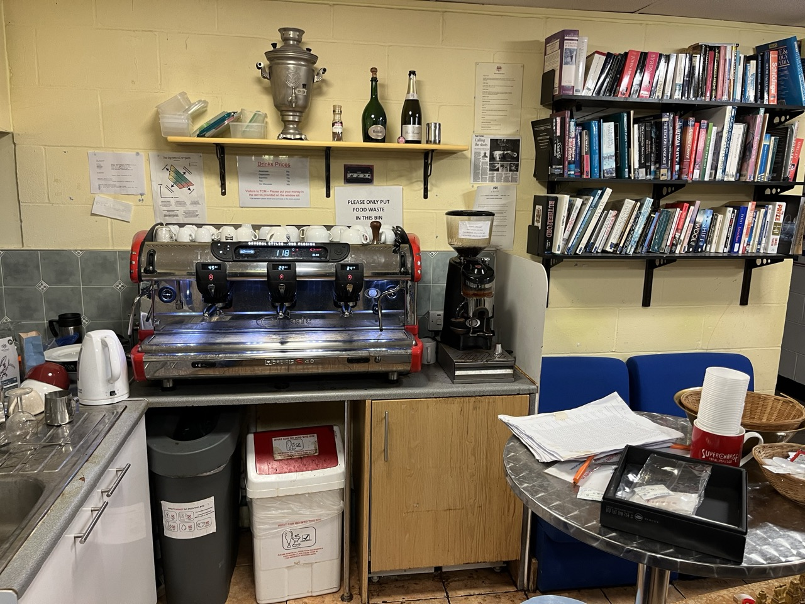
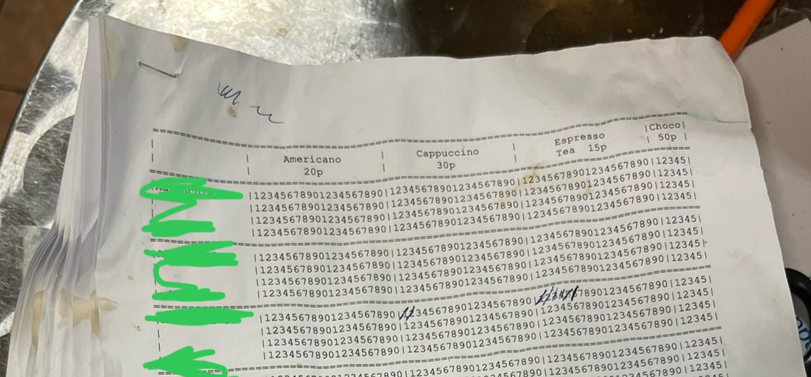
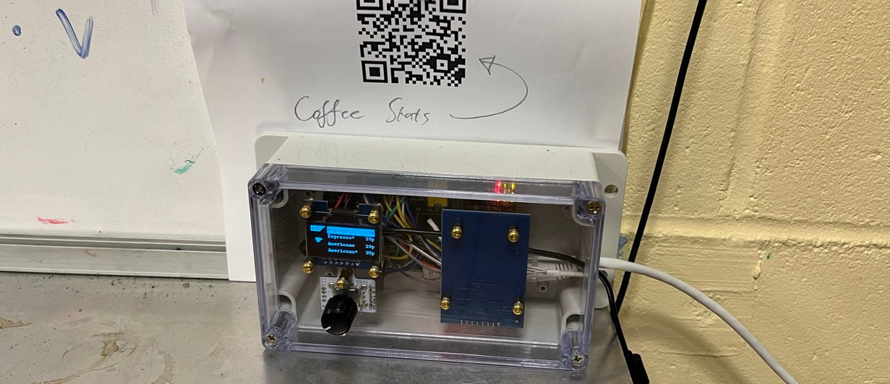
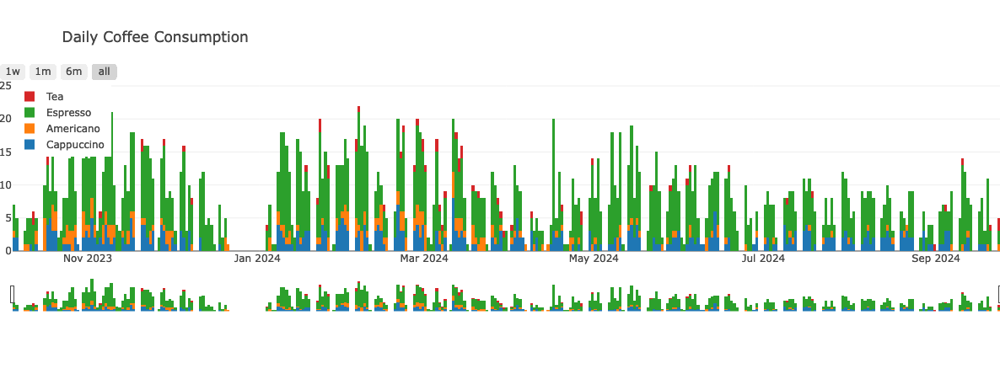

The building in which TCM lives at the time of writing is, in many ways, not very nice (it was meant to be demolished a month ago). Nonetheless, we have a _very_ nice coffee machine:

To pay for coffee, one ticks one's name off on a ledger:

At the end of a term, an unfortuante soul is conscripted to count up all the ticks and update the running tally. Though perfectly functional, this was not "cutting edge research" enough for my liking. Enter:

# beanbot: an honesty box for the cashless office

To use it, you

1. Rotate the knob to select the drink you want, and 
2. Tap your university card.

That's it. 

<video controls width="740px">
<source src="../assets/using_beanbot.webm" type="video/webm">
<source src="../assets/using_beanbot.mp4" type="video/mp4">
Your browser does not support the video tag.
</video>

Most people here seem to like using it, leading to some interesting stats:

## Timeseries

You can pretty much read the Cambridge term structure directly off this graph - Michaelmas Oct - Nov, Lent Jan-Mar, Easter May-Jul. 

## Time of Day

The Gaussian is modified in the centre by our habit of going to lunch at 12 (so no coffees) and coming back 13-13:30 for a coffee (large spike). Notice the outliers at 4:30 and 21:00.

# Building Beanbot

There were quite a few non-negotiable requirements when building this thing.

1. Very good backups, logs, and tracebacks (I don't have the resources to fully verify that the code is bug free, but I can at least make sure that any problems can be backtraced with frequent backups) 
2. Minimal use of client data for GDPR reasons
3. Ability to change the price of coffee on the fly
4. Ability to compensate for typographic errors
5. Ease of use
6. Web security
7. Do not read any data off users' university cards, and definitely don't risk corrupting them

The nice-to-haves were
1. Ability to register users without manual intervention
2. Minimal dependence on external packages and services
3. Low cost
4. Do not rely on users having a standard university card (visitors, lost cards, etc., further, not everyone would necessarily trust that I have implemented the card correctly)

Moving from engineering to marketing - the entire exercise depends on people's trust that the box does what it should. For this reason, it was important that
1. The users see an up-to-date balance, confirming that the swipe was recorded correctly,
2. Statistics are visible, showing reasonable numbers per day.

# Hardware

The whole system is based on a vintage 2011 Raspberry Pi Model B, from the era before Wi-Fi was standard, with a few peripherals:
- MFRC522 RFID module (Ebay, Aliexpress, etc.)
- OLED display (Jaycar)
- Encoder module with click (The Pi Hut)

Though I considered using an ESP32 for the main controller, the difficulty of connecting IoT devices (especially ones without keyboards) to eduroam convinced me that this was a bad idea. The old-school wired ethernet connection keeping the RPi talking to the world is bulletproof, allowing for straightforward maintenance ovr SSH.

## Cambridge Cards (camcards)

I needed some kind of convenient way to track users, and camcards were an obvious choice - everyone has one, they follow a common standard (Mifare Classic 4k, 4-byte UID), and they should store everyone's Cambridge ID and name on them, making it easy and error-free to assign the correct transaction to them.

There was a problem, though -- One cannot read any data off Mifare cards without a cryptographic key, which [(at least in theory)](https://brandonhinkel.com/2018/08/08/breaking-hardened-mifare-proxmark3.html) is known only to the university IT department. 
Though it is [worryingly straightforward](https://arkandas.com/blog/mifare_classic_cracking) to exploit the weak cryptography of the Mifare Classic standard to obtain the private keys without permission, I got the impression that the powers that be would not take kindly to my hacking their system for a coffee machine.

Even without this key, it is still possible to authenticate to the hard-coded "block zero" of these cards, which stores a number called the card UID. This is essentially a serial number programmed in at the factory -- though it is not strictly speaking guaranteed to always be unique between any two cards in the world, I gambled that a UID collision would be sufficiently unlikely that it was not worth worrying about.

This came with an unexpected advantage - by only storing the most basic possible information, the system can work with essentially _any_ RFID card in existence, allowing visitors to use the system as well as group members. The downside: there is no way to tell _a priori_ which crsid has what UID, meaning that users will need to complete an annoying registration step to start using the system. 

## Encoder

I found out the hard way that cheap encoders wear out _very_ quickly - only six months of use killed the Pi Hut's Fermion-brand board I had installed.

# Software

The stack is fairly straightforward: The Pi hosts an SQLite3 database, which is accessed by both the GUI process (beanbot) and the web server (beanserver). For security, I made sure that the server only ever reads from the database.

## The database

There are three tables - `users`, `transactions`, and `transactionlog`. The third table records all writes to `transactions` as a checksum, but it serves no other purpose, and so I will focus on `users` and `transactions`.

`users` has three columns:
- `crsid`, the user-provided identifier,
- `rfid`, the UID of the user's RFID card, and
- `debt`, the user's total debt in pence (integer).

this table associates RFID data with `crsid`s, and includes a checksum for the transaction history.

`transactions` is the digital ledger, with columns
- `ts`, the timestamp (seconds since UNIX epoch)
- `crsid`
- `rfid` the RFID used with this transaction. 
- `type` the kind of coffee the user ordered 
- `debit` the number of pence charged for this item 
- `ncoffee` the number of shots in the item purchased

I store all three of `ncoffee`, `type`, and `debit` to deal with the edge case that I may decide to change the price or caffeine content of an item at a future date.

## The hardware interface

I wrote this in Python. This is not the best choice from a software perspective (the inability of the standard RPi.GPIO library to correctly process interrupts was extremely frustrating), but it was certainly quick to write. Performance is far from an issue with such a simple interface.

## The web server

I run a Flask app behind an NGINX load balancer. This allows for efficient service of static assets like images and HTML without burdening the senior-citizen, decade-old CPU with serving a request through a bloated, inefficient python app.

Flask's only job is running a RESTful API that handles read-only queries on the database, allowing all members of my group to check their balances in real time. I documented this using [flasgger](https://github.com/flasgger/flasgger), which after an hour or two of setup pain made the whole process relatively straightforward and clean.

# What's good about this
The electronic system is very popular – a large part of the group signed up unprompted, and continue to use the system daily to track their expenses.

The database structure was sufficiently sane that I could handle edge cases - one user misspelled their `crsid`, another got a replaced camcard, accounts needed to be merged, reconfigured and deleted, all of which were possible without breaking the frontend.

# What's not so good about this
The encoder is wired directly to the Raspberry Pi, with only the most rudimentary possible debounce circuitry. Because of this, the knob is often far less than responsive to user input - because the Pi is busy running Debian, it often misses clicks of the encoder. A better solution would have a dedicated, cheap microcontroller (e.g. a PICAXE) dedicated to tracking and locally storing the encoder position, which can be polled by the Pi at some sensible rate (say, 30Hz). A skillfully programmed ESP32 could in principle handle both networking and hardware interrupts in a single package, however the development time would have been much longer.

Registration is an annoying problem, made ten times so by the irritating, very slow encoder. Some users have tried to type their `crsid`s by hand using the twisty-knob interface -- entering only six alphanumeric characters can easily take upwards of 5 minutes. Better solutions certainly exist - pressing a button on the website to register is an obvious one - however opening up database write access to the web service is a headache I was not prepared to address in the short time I had to finish this project.

